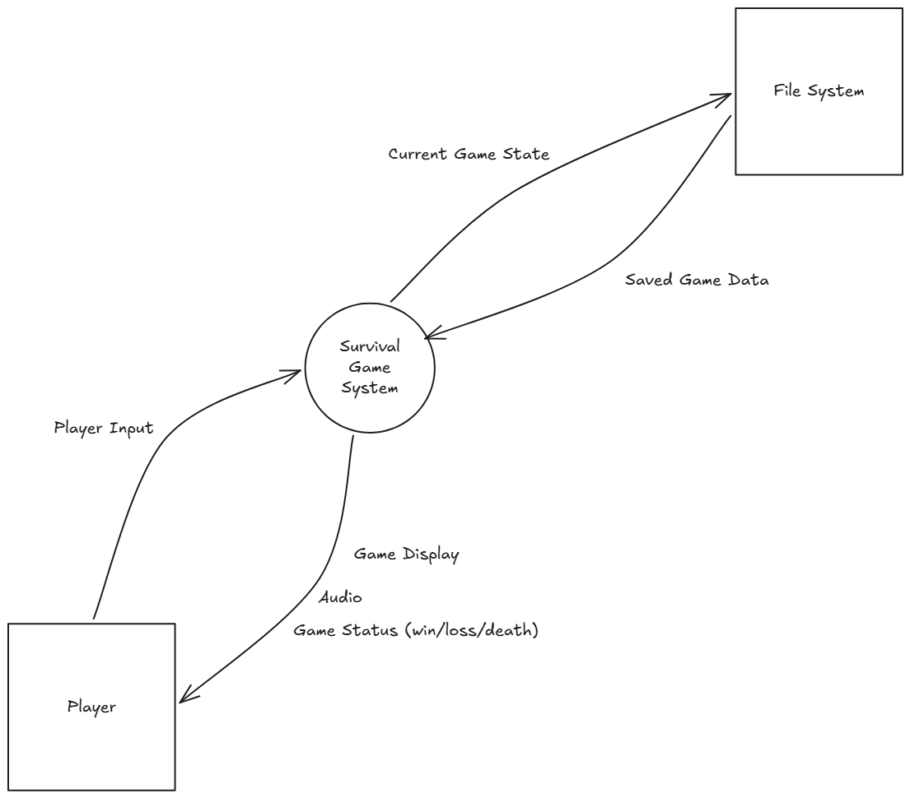
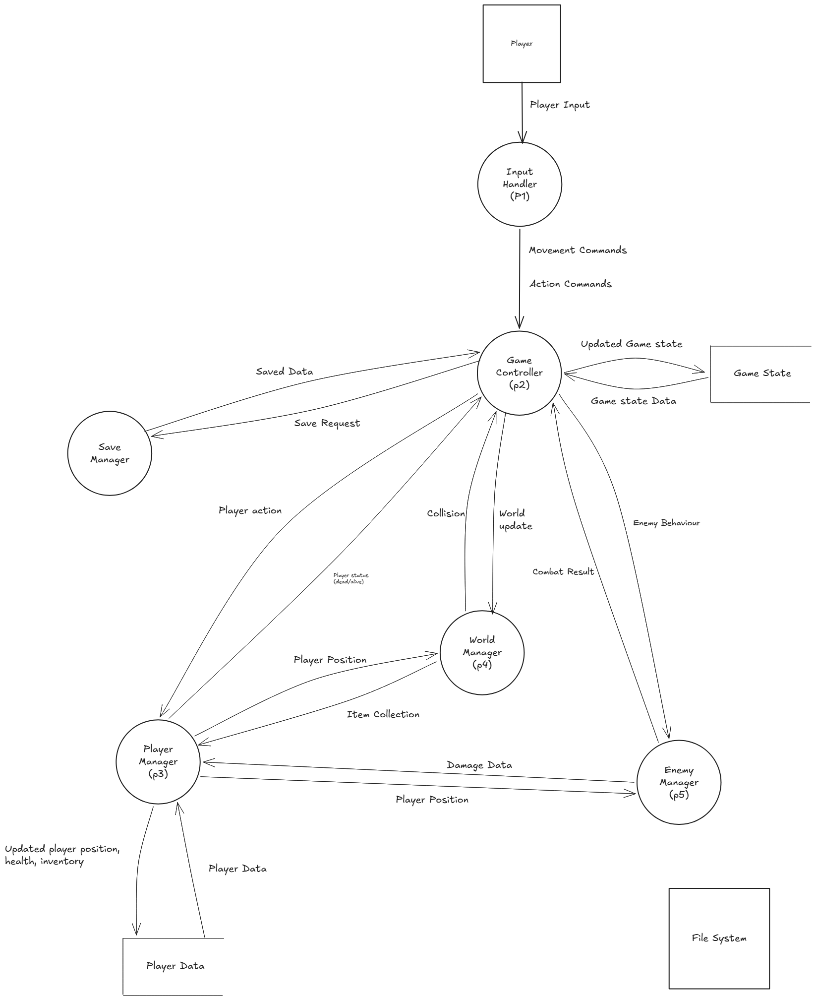
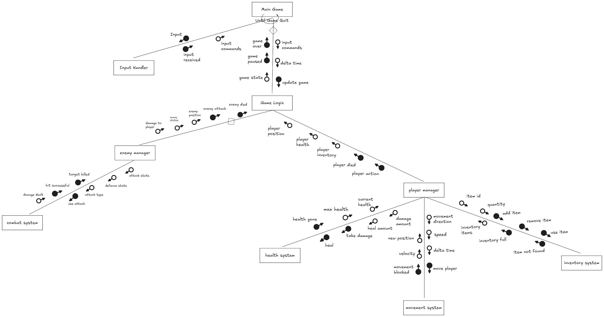

# **Software Project Report - A Survival Game**
##### *By Yyoung Du*

## **Part 1 - Identifying and Defining**
### 1.1 Problem Statement
---
#### **Outline the problem or opportunity that the project addresses. Consider who is affected by this issue.**
*The Problem:* \
Students and young people today experience high levels of stress and anxiety from academic pressures, social media, and daily challenges. Many lack outlets, taps, that provide  mental breaks and stress relief. While entertainment options exist, there's a need for accessible games that offers an escape and relaxation without requiring expensive hardware or significant time commitments.\

*Who is Affected:*
- Students (ages 13-25) dealing with exam stress, assignment pressure, and academic workload
- Young people experiencing anxiety and needing healthy coping mechanisms
- Casual gamers looking for engaging but not overwhelming gaming experiences during study breaks
- Individuals with limited budgets who cannot afford expensive games or high-end gaming systems

#### **Explain why this problem or opportunity is significant.** 
*Mental Health Impact:* 
- Student mental health has declined significantly, with studies showing increased rates of stress, anxiety, and burnout among young people
- Academic pressure is high, with students experiencing demanding workloads and competitive environments
- Poor mental health directly impacts academic performance, relationships, and wellbeing

*Consequences of Unmanaged Stress:*
- Chronic stress leads to decreased concentration, memory problems, and reduced learning capacity
- Students without healthy coping mechanisms may turn to harmful alternatives or simply burn out
- High stress levels can result in serious mental and physical health issues

*Lack of Breaks and Recreation:*
- Many students don't take adequate breaks, leading to diminishing returns on study time
- Without accessible recreational outlets, stress accumulates rather than being released
- The pressure to be constantly productive leaves little room for necessary downtime

*Widespread Impact:*
- This affects not just individual students but entire school communities and family systems
- Stressed students create stressful environments for peers and teachers

#### **Justify the development of a software solution as an appropriate response.** 
*Accessibility and Low Barrier to Entry:*
- A software game can be distributed digitally at minimal or no cost, making it accessible to students regardless of economic background
- Unlike physical recreation (sports equipment, gym memberships), software requires no additional purchases beyond a basic computer
- Students can access it from home, school, or anywhere they have a device

*Convenience and Flexibility:*
- Software is available on-demand, 24/7, whenever a student needs a mental break
- No need to coordinate with others, travel to locations, or wait for specific times
- Players can engage for 5 minutes or 50 minutes depending on their available time
- Fits naturally into study routines as a break between tasks

*Engaging and Interactive:*
- Unlike passive stress relief (watching videos), games require active engagement which is more effective as distractions from stress
- Interactive gameplay provides mental stimulation that helps reset focus and attention
- The challenge-reward creates genuine enjoyment and satisfaction
&nbsp; \
&nbsp; 
### 1.2 Project Purpose and Boundaries
---
#### **Outline what the project is trying to achieve**
1. *Create a Functional Survival Game*
    - Develop a playable top-down survival game using Unity and C# in Visual Studio Code
    - Implement core survival mechanics including resource management, health/hunger systems, and environmental challenges
    - Design and code enemy AI or hazards that create meaningful gameplay challenges

2. Deliver an Engaging Player Experience
    - Provide accessible, enjoyable entertainment that offers stress relief through engaging gameplay
    - Design easy to understand controls and mechanics that are easy to learn
    - Implement a basic storyline that gives context and purpose to the survival gameplay
&nbsp; \
&nbsp;
### 1.3 Stakeholder Requirements
---
#### **Identify stakeholders (client, users, teacher, peers).**
#### **Describe their needs, expectations, and how these influenced the project direction.**
1. End Users (Players - Students aged 13-25)
    - Needs
        - Easy-to-understand controls and mechanics
        - Engaging gameplay that provides stress relief and entertainment
        - A game that runs smoothly on basic/school computers
        - Clear objectives and feedback on progress
        - Appropriate challenge level - not too easy, not frustratingly difficult

    - Expectations
        - Intuitive user interface that doesn't require lengthy tutorials
        - Responsive controls and fair gameplay mechanics
        - Some replay value or reason to continue playing
        - A complete experience with a beginning, middle, and end
        - Minimal bugs that don't break the game experience

    - Influence on Project Direction:
        - Simple top-down perspective for accessibility
        - Basic graphics that prioritize performance over visual complexity
        - Clear UI showing health, hunger, and other vital information
        - Straightforward gameplay loop that's easy to pick up
        - Short play sessions that fit into study breaks (10-30 minutes)
&nbsp; \
&nbsp;
### 1.4 Functional Requirements
---
#### **List and describe what the system must do**
1. Player Movement and Control
    - The system must allow the player to move their character in four directions (up, down, left, right) or eight directions (including diagonals) using keyboard input (WASD or arrow keys)
    - The player character must respond immediately to input with smooth, predictable movement
    - Movement speed must be consistent and controllable
    - The system must prevent the player from moving through solid objects, walls, or boundaries

2. Health System
    - The system must track and display the player's current health value
    - Health must decrease when the player takes damage from enemies or the environment
    - The system must allow health to be restored through consumable items  (health packs, food, etc.) or natural regeneration
    - When health reaches zero, the player needs to die
    - Health values must be visible to the player through a UI element (health bar, numerical display, or hearts)

3. Hunger Meter System
    - The system must track a hunger meter that decreases over time
    - The hunger meter must be replenished by consuming food items
    - When hunger reaches critical levels, the system must apply penalties (health loss, reduced movement speed, etc.)
    - Hunger levels must be clearly displayed to the player via UI
    - The system must warn the player when hunger is critically low

4. Resource Collection
    - The system must allow players to collect resources from the environment (food, crafting materials, health items)
    - Resources must be added to the player's inventory when collected
    - The system must provide visual/audio feedback when resources are collected
    - Collectible resources must disappear from the game world after being picked up
    - The system must spawn or place resources at appropriate locations in the game world

5. Inventory Management
    - The system must have an inventory that stores collected items
    - The inventory must have a maximum capacity (limited slots or weight)
    - Players must be able to view their current inventory through a UI screen
    - The system must allow players to use/consume items from their inventory
    - Items must be removed from inventory when used or consumed

6. Crafting System (Optional but recommended)
    - The system must allow players to combine resources to create new items
    - A crafting interface must display available recipes based on current inventory
    - The system must consume the required materials when crafting succeeds
    - The crafted item must be added to the player's inventory
    - The system must prevent crafting if required materials are unavailable

7. Enemy
    - The system must spawn enemies or environmental hazards at designated locations
    - Enemies must have basic pathing (patrol, chase player, attack)

&nbsp; \
&nbsp;
### 1.5 Non-Functional Requirements
---
#### **List and describe system qualities**
1. Performance
    - Frame Rate: The game must maintain a consistent fps of at least 30 FPS
    - Load Times: The game must be able to load from the main menu within 10 seconds
    - Response Time: Player input must be displayed through the screen within 100 milliseconds
    - Memory Usage: The game must not exceed 2GB of RAM usage during normal gameplay
    - Optimization: The game must not experience frame drops or stuttering

2. Usability
    - Learning Curve: New players must be able to understand basic controls and mechanics
    - UI Readability: All text must be readable from a standard viewing distance
    - Navigation: Players must be able to access the pause menu, inventory, and return to main menu
    - Consistency: Controls and UI elements must remain consistent throughout the game (same button always does the same action)
    - Error Prevention: The system must prevent common user errors

3. Security
    - Data Integrity: Save files must be stored securely and be validated to help prevent corruption
    - No Exploits: The game must not allow players to exploit bugs to gain unfair advantages that break the game
    - Privacy: No personal data or identifying information is collected, stored, or transmitted (single-player, offline game)

4. Reliability
    - Stability: The game must run without crashes, freezing, or stuttering
    - Error Handling: The system must handle errors without crashing
    - Save Reliability: Save/load functionality must work 100% of the time
    - Consistent Behavior: Game mechanics must behave identically every time
    - Recovery: If the game encounters an error, it must either recover automatically or provide clear instructions to the player on how to resolve the issue
    - Reproducibility: Game behavior must be predictable and reproducible
&nbsp; \
&nbsp;
### 1.6 Constraints
--- 
#### **Identify limitations affecting the project**
1. Time Constraints
    - Assessment Deadline: The project must be completed by Week 8 of Term 2, limiting the total development time available
    - Competing Assessments: Other assignments, exams and projects will occur at the same time, reducing the time available for this project
    - Development Restrictions: Limited time means features, mostly the ones listed in Functional Requirements, must be prioritized
    - Testing Time: Insufficient time for testing all the features & aspects of the game may mean in some bugs and balance issues might occur with the final project
    - Learning Programming: As I am not extremely proficient in C#, time needs to be spend leaning the program, limiting my time developing the project itself.

2. Technical Knowledge Constraints
    - Unity Experience: Very limited experience in developing complex Unity games means I will have to learn how to use most complex systems while developing this project
    - Optimization: Lack of knowledge about performance optimization, especially in Unity. This may  mean the final project is not fully optimised, resulting in some inefficient code.
    - Animation: Limited knowledge of Unity's animation system will mean character animations will only be basic sprite swapping

3. Hardware / Software Constraints
    - Computer Specs: Limited to just my personal PC while developing the game. This means that the end user's experience may differ from mine as I have a relatively high end PC. Users with lower end hardware may experience stutters or slow performance not detected by my personal testing.
        - Testing on lower end hardware is needed to satisfy part of my problem I want to solve.
    - Limited to free software such as Unity and VS Code.
    - Limited to free assets for graphics and sounds
&nbsp; \
&nbsp;
### 1.7 Requirements Analysis and Prioritisation
--- 
#### **Analyse the functional and non-functional requirements**
The project prioritizes functionality that allow the game to be playable. Systems such as movement, health, items, inventory and UI form the very basics of a survival game. Performance and usability were prioritized within the non-functional requirements. This is because a smooth and intuitive gameplay is essential for stress relief. Lag and confusing controls would create frustration rather than reduce it. Next, requirements like the hunger, enemies, combat, and crafting add depth but can be simplified or cut if time runs short, while low priority features like save systems and a extensive storyline are nice additions to have that don't impact the core experience.

Due to project constraints, several compromises will be made in the final game. Limited time means the game will focus on a few core mechanics done that will be well made rather than many half finished and sloppy features. This means the game will have features 2D graphics, basic enemy behavior, and a smaller game world, but instead, everything will works properly and smoothly. With only beginner level Unity and C# skills, the game will use simple techniques mostly found in tutorials rather than complex custom systems. This means things like enemies will have simple mechanics instead of an advanced algorithm, and the game will rely on Unity's built-in tools rather than complicated code. Money for assets, graphics and sounds is nonexistant, meaning most of them will come from free online libraries. This means the visual and audio will be extremely basic but functional. These constraints means that the final game will be simpler and less polished than commercial games, but will result in a complete, playable and mostly bugless game.

## **Part 2 - Research and Planning**
### 2.1 Development Methodology
--- 
#### **Describe the development approach used (e.g. Agile, Waterfall, WAgile).**
#### **Justify the suitability of this methodology.**
This project will follow an Agile development approach with short 2-week sprint cycles. The development will be divided into sprints, with each sprint focusing on specific features: Sprint 1 covers player movement and basic UI, Sprint 2 implements health and inventory systems, Sprint 3 adds enemies and combat, Sprint 4 focuses on polish and additional features like hunger or crafting if time permits, and Sprint 5 is dedicated to final testing and documentation. After each sprint, the game will be playtested to identify bugs and receive feedback.

Agile is suitable for this project due to its flexibility in handling smaller projects, time constraints, and its ability to receive feedback. As a small solo project with many different systems (health, inventory, enemies) and a beginner developer learning Unity, Agile allows building the game piece-by-piece rather than planning everything upfront. This means if a feature like crafting proves too complex, it can be unprioritized without derailing the entire project. Most importantly, Agile's cyclical nature allows for regular testing, allowing early detection of problems when they're still easy to fix.
&nbsp; \
&nbsp;
### 2.2 Tools and Technologies
--- 
#### **Justify the selection of software applications, engines, developer tools, programming languages, IDEs, frameworks, libraries and/or hardware components.**
#### **Explain how these tools supported efficient and effective development.**
The core development tools selected were Unity as the game engine, C# as the programming language, and Visual Studio Code as the IDE. Unity was chosen because it's completely free for students, has extensive beginner-friendly tutorials and functions, and is specifically well-suited for 2D top-down games with built-in physics engines and sprite rendering systems. C# was chosen as it is Unity's scripting language. Visual Studio Code was selected because it's free, provides excellent Unity integration and error detection. Tools such as GitHub [text](<../../../../../Downloads/Gantt Chart - Software Engineering - Year 12 Project - Sheet1.pdf>)were used for version control. It allowed forbackups and commit history documentation of the development process. Free graphics tools and asset libraries such as itch.io were used to get premade sprite packs and UI elements, saving time and also saving me from drawing horrible art.
&nbsp; \
&nbsp;
### 2.3 Gantt Chart / Timeline
--- 

&nbsp; \
&nbsp;
### 2.4 Communication Plan
--- 
#### **Explain how client or peer feedback was obtained and incorporated.**
TO BE CONTINUED (HAVENT COMPLETED YET)
&nbsp; \
&nbsp;
### 2.5 Resource Allocation Justification
--- 
#### **Justify the resource allocation for the project**

## **Part 3 - System Design**
&nbsp; \
&nbsp;
### 3.1 Context Diagram

&nbsp; \
&nbsp;
### 3.2 Data Flow Diagram
---

P.S Ignore the File System. I forgot to delete it.
&nbsp; \
&nbsp;
### 3.3 Structure Chart

&nbsp; \
&nbsp;
### 3.4 IPO Chart
|Input|Process|Output|
|-----|-----|-----|
|Keyboard (WASD)| - Detects key presses   - Calculates movement direction and movement speed   - Check for collisions   - Updates player position.| - New player position|
|Damage Amount (From Enemy)   Heal amount (From Consumable) | - Subtract damage from current health   - Add heal amount to current health   -Check if health ≤ 0| - Update current health value   - Death flag (if health = 0)   - Updated health bar  |
|Item ID   Item Quantity   Player Action (Collect/Use/Drop)| - Check inventory capacity   - Add item to inventory   - Remove item from inventory   - Apply item effect   - Update inventory count| - Updated inventory contents   - Inventory full message   - Updated inventory UI|
|Player position   Enemy position| - Calculate distance from player   - Calculate path to player   - Update enemy position   - Check attack range| - New enemy position   - Attack (if in range)   - Updated enemy state|
|Attack Stats   Defence Stats  | - Check if target is in attack range   - Calculate damage   - Apply damage to target   | - Damage dealt to target   - Updated target health  |
|Delta time   Food consumed   Current health | - Decrease hunger over time   - Increase hunger value when fod consumed   - Apply starvation debuffs when hunger low | - Updated hunger value   - Hunger bar UI updated   - Health and movement penalty when hunger = 0|
&nbsp; \
&nbsp;
### 3.5 Data Dictionary
|Name|Type|Description
|---|---|---|
|playerID|Integer|Helps identifies each player's character|
|playerName|String|Name of character|
|playerPosition|Vector2|Player's current x and y coordinates|
|playerHealth|Float|Current health value of the player|
|maxHealth|Float|Maximum health value the player can have|
|playerHunger|Float|Current hunger value of the player|
|maxHunger|Float|Maximum hunger value the player can have|
|movementSpeed|Float|Speed value used for player movement|
|isAlive|Boolean|Indicates whether the player is alive or dead|
|attackDamage|Float|Amount of damage dealt by player attacks|
|defence|Float|Damage reduction stat used during combat calculations|